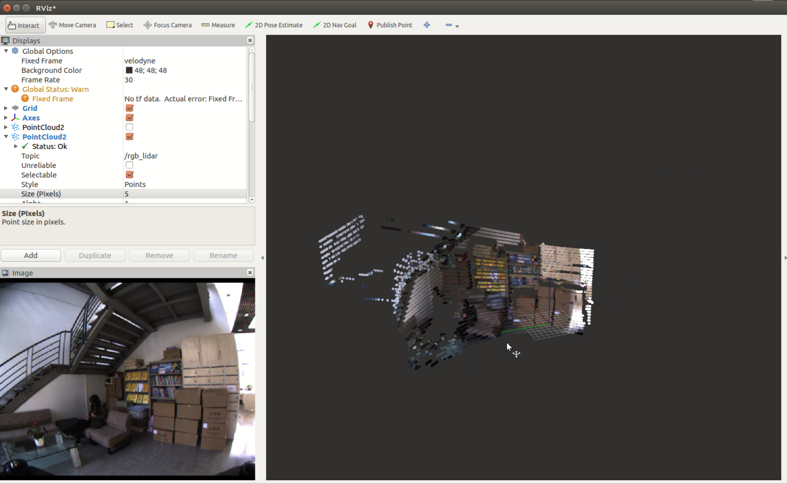

# lidar_camera_calib

### 图像提取标定板角点libcbdetect

 opencv提取标定板的方法和 [camodocal](https://github.com/hengli/camodocal) 提取标定板对图像有一定要求，而[LIBCBDETECT](http://www.cvlibs.net/software/libcbdetect/)几乎可以百分百提取出标定板。所以用的是matlab版的libcbdetect。cpp版本的有人写过，但是不完整，还未完全实现（[参考](https://github.com/onlyliucat/Multi-chessboard-Corner-extraction-detection-)）。


### 激光提取标定板角点ilcc2

参考[ILCC](https://github.com/mfxox/ILCC)

这里重新用cpp实现。

### 激光投影回相机效果


### 相机投影到激光




### 提交代码

https://gitee.com/help/articles/4122


```
git clone https://gitee.com/用户个性地址/HelloGitee.git #将远程仓库克隆到本地
```
修改代码后，在仓库目录下执行下面命令

```
$ git add . #将当前目录所有文件添加到git暂存区
$ git commit -m "my first commit" #提交并备注提交信息
$ git push origin master #将本地提交推送到远程仓库
```

//从远程的origin仓库的master分支下载代码到本地的origin master
```
git fetch origin master
```


### git pull 与 git fetch的区别
git pull命令的作用是：取回远程主机某个分支的更新，再与本地的指定分支合并。

一句话总结git pull和git fetch的区别：git pull = git fetch + git merge

git fetch不会进行合并执行后需要手动执行git merge合并分支，而git pull拉取远程分之后直接与本地分支进行合并。更准确地说，git pull使用给定的参数运行git fetch，并调用git merge将检索到的分支头合并到当前分支中。
