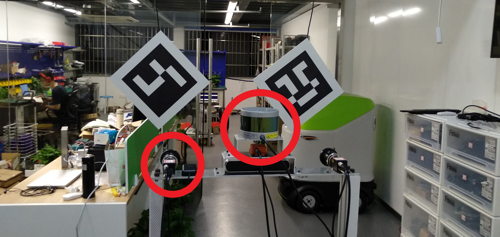
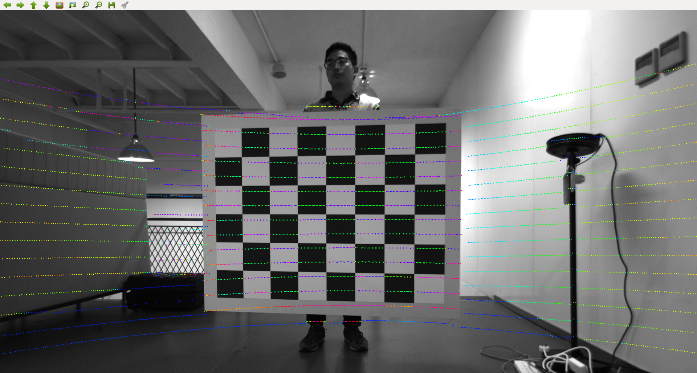
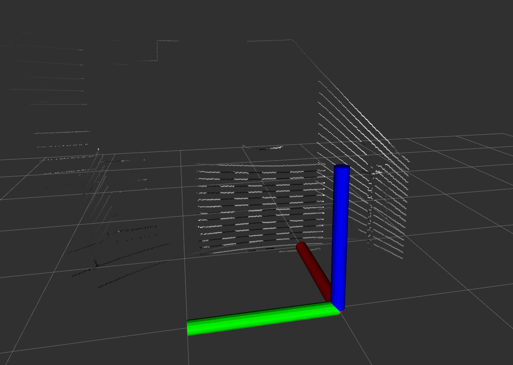
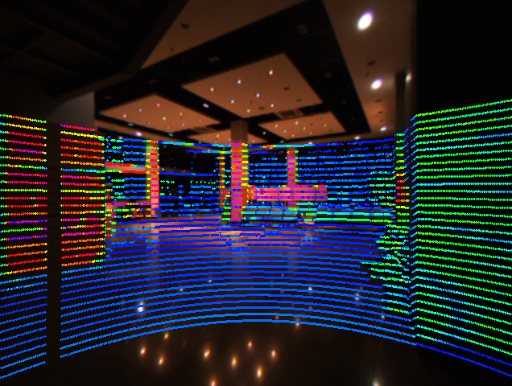

# lidar_camera_calib

[TOC]

### 1.基本思想

提取图像上标定板的像素坐标,在对应的激光帧中提取标定板的3D角点位置,解决一个2D-3D算Rt的问题.图像上提取角点用 [libcbdetect](http://www.cvlibs.net/software/libcbdetect/),激光数据中提标定板参考[ILCC方法](https://github.com/mfxox/ILCC),这个方法对标定板要求比较高,要求激光在标定板白色区域与黑色区域的反射强度区别明显.下面我用标定pointGrey相机与velodyne16线为例,说明实验流程.

### 2.数据采集

激光和图像之间的距离最好比较接近(经验,暂时不知道理论依据).

传感器静止,在不同地方采集多次数据,注意激光的每根线最好都用上,即最好每根线都射在标定板上,充分利用激光数据.下面是一个录制bag的例子,`-l NUM`参数表示 `only record NUM messages on each topic`.

```
rosbag record /camera_topic /lidar_topic -l 3
```

一般会在6到8个不同方位采集数据.下面是一些采集数据的例子.录制的bag放在**bag文件夹**下.


### 3. 相机标定

相机标定用的是用matlab的相机标定工具箱,将标定结果整理成以下yaml格式.这里还设置了标定板的3个参数,标定板两个轴的角点数,标定板一个格子的大小(单位是米).

```yaml
%YAML:1.0

K: !!opencv-matrix
   rows: 3
   cols: 3
   dt: d
   data: [1061.37439737547, 0, 980.706836288949,0, 1061.02435228316, 601.685030610243,0, 0, 1]
d: !!opencv-matrix
   rows: 5
   cols: 1
   dt: d
   data: [-0.149007007770170, 0.0729485326193990, 0.000257753168848673, -0.000207183134328829, 0]

Camera.width: 1920
Camera.height: 1200

grid_length: 0.15
corner_in_x: 7
corner_in_y: 5
```

将结果保存到`config`目录下,命名为`pointgrey.yaml`.

运行`image_corners.launch`,**得到去畸变后的图片,图片保存在`process_data`文件夹下.**

**注意修改launch里的参数**.`bag_path_prefix`包含的bag的路径和bag的命名前缀.

```shell
roslaunch ilcc2 image_corners.launch
```

### 4. 图像提取标定板角点libcbdetect

 opencv提取标定板的方法和 [camodocal](https://github.com/hengli/camodocal) 提取标定板对图像有一定要求，而[LIBCBDETECT](http://www.cvlibs.net/software/libcbdetect/)几乎可以百分百提取出标定板。所以用的是matlab版的libcbdetect。cpp版本[在这里](https://gitee.com/csc105_slam_group/libcbdetect_cpp)。
 

在本分支中,提供了修改过后的matlab版的libcbdetect.通过`demo.m`与`demo_all_pic.m`,可以提取出标定板角点.下面是一个角点提取结果例子,前半部分是角点横坐标,后半部分是对应的纵坐标(也存在反一反的情况).
 

```
1143.7 1143 1142.5 1142 1141.4
1060.6 1060.2 1059.9 1059.7 1059.5
979.01 978.81 978.78 978.83 978.83
898.94 899.05 899.23 899.47 899.78
820.18 820.41 820.9 821.33 821.84
742.66 743.33 743.9 744.68 745.51
666.68 667.48 668.4 669.35 670.46
398.18 481.36 564.03 646.08 727.64
399.5 481.91 563.87 645.24 726.04
400.79 482.44 563.67 644.36 724.52
402.03 482.98 563.47 643.46 722.98
403.23 483.52 563.33 642.6 721.49
404.51 484.15 563.2 641.77 719.95
405.82 484.64 563.03 640.99 718.46
```


### 5.激光提取标定板角点ilcc2

参考[ILCC](https://github.com/mfxox/ILCC).这里重新用cpp实现。

**注意launch里的参数.需要修改bag的路径.**

```shell
roslaunch ilcc2 lidar_corners.launch
```

程序会弹出两个pcl_viewer,分别是`visual_corners`与`visual_chessboard`.**注意看终端提示!**终端提示说需要分布一个 `/click_point`的topic,程序会根据这个点,在这个点的周围一定范围内是点云的ROI区域,在ROI区域提取平面.打开rviz,显示激光数据,选中rviz的**Publish Point功能**,在标定板点云的中间点一个点.之后在`visual_chessboard`界面会显示提取结果,提取结果用粉色点云表示.

  

左图是正确的提取结果,右图误认为墙面点云是标定板点云.

**按照终端提示**
```shell
o: confirm;  r: change /click_point; w: plane_idx++; s: plane_idx--; now plane_inx = 1
```

|     按键      |                    作用                    |
| :-----------: | :----------------------------------------: |
|       o       |               标定板提取正确               |
|       r       | 重新选取聚类点(重新发布一个`/click_point`) |
|       w       |  平面点云选取错误,试试下一个提取到的平面   |
|       s       |  平面点云选取错误,试试上一个提取到的平面   |
| now plane_inx |                当前平面索引                |

遇到上面右图结果,可以按`w`试试看.**注意按键盘时需要确保`visual_chessboard`是激活窗口,而不是在终端按w键!**

再次注意,如果没有按键响应,可能原因是不在`visual_chessboard`窗口下按的.


若提取正确,按o键后,`visual_corners`界面会显示角点提取结果.一共有两张标定板的图,一张是在激光原点,一张是在原始位置.其中在原始位置的标定板有粉色点,也就是激光角点.观察激光角点,按照终端提示进行操作.


```cpp
k: confirm;  d: do optim again; a: rotate board; r:reject this scan
```

| 按键 |        作用         |
| :--: | :-----------------: |
|  k   |    角点提取正确     |
|  d   |     左右移一移      |
|  a   |     标定板旋转      |
|  r   | 这帧数据不好,不要了 |

遇到上面左图结果,可以试着按`d`;遇到上面右图结果,可以试着按`a`.最终正确的结果如下图所示.粉色角点提取正确.按k键确认.**注意,这里按按键时需要确保`visual_corners`是激活窗口.**


之后分别对其他方位的数据也是相同的处理步骤.总结如下

- 在rviz中,利用Publish Point功能,发布`/click_point` topic.
- 观察`visual_chessboard`界面中的粉色点云是否对应是标定板点云,按`o`键确认.
- 观察`visual_corners`界面,粉色角点若提取正确,按`k`键确认.

激光的角点提取结果会保存在`process_data`文件夹下.下面是一个提取结果例子.每一行表示一个3D标定板角点在激光坐标系下位置,一共35行.

```
2.08881 0.609289 0.302605
2.07478 0.459948 0.30224
2.06074 0.310606 0.301874
......
2.06503 0.0103461 -0.29798
2.05099 -0.138995 -0.298345
2.03696 -0.288337 -0.29871
```

### 6. 标定激光与相机外参

现在,在`process_data`文件夹下有,激光角点文件,相机角点文件,去畸变后的图像.

根据这些数据,可标定激光与相机的外参.

```shell
roslaunch ilcc2 calib_lidar_cam.launch
```
**运行前需要修改**`ilcc2/test/calib_lidar_cam.cpp`里的设置激光与相机初始外参的函数.

如果激光与相机如下图示意图所示安装,类似与`cam_name == "front"`的情况.



相机左转90度,则是`cam_name == "left"`的情况..标定pointgrey与velodyne时,情况与`cam_name == "front"`一致.**可以根据传感器的安装方式不同,设定传感器外参的初始值,至少保证两个传感器的坐标系方向一致!**

```cpp
 /// 这个是为了让相机和激光坐标系方向一致
Eigen::Isometry3d get_lidar2cam_axis_roughly(std::string cam_name){

  Eigen::AngleAxisd R_lidarToCamera;
  if(cam_name == "front" || cam_name == "car_left" || cam_name == "pointgrey")
    R_lidarToCamera = Eigen::AngleAxisd(-1.57, Eigen::Vector3d::UnitY())
                     *Eigen::AngleAxisd(1.57, Eigen::Vector3d::UnitX());
  if(cam_name == "left")
    R_lidarToCamera = Eigen::AngleAxisd(1.57, Eigen::Vector3d::UnitX());
  if(cam_name == "right")
    R_lidarToCamera = Eigen::AngleAxisd(1.57, Eigen::Vector3d::UnitX())
                     *Eigen::AngleAxisd(3.14, Eigen::Vector3d::UnitZ());
  if(cam_name == "back")
    R_lidarToCamera = Eigen::AngleAxisd(1.57, Eigen::Vector3d::UnitY())
                     *Eigen::AngleAxisd(1.57, Eigen::Vector3d::UnitX());

  Eigen::Isometry3d T_lidar2cam_axis_roughly = Eigen::Isometry3d::Identity();
  T_lidar2cam_axis_roughly.rotate(R_lidarToCamera.matrix());

  return T_lidar2cam_axis_roughly;
}
```


 

若初始外参设置正确,在`lidar_camera_corners`窗口中可以看到绿色相机角点与红色激光角点.该主要是为了确保lidar角点与相机角点的对应关系一致,只要红色点和绿色的排序方式一样即可(一般不会出问题,按任意键跳过即可).

如果看不到红色激光点,很有可能是初始外参设置出错,需要重新修改`get_lidar2cam_axis_roughly`函数.


标定好之后,会显示重投影结果(如上图所示).最终标定的结果会在终端输出,也会保存为bin文件存在config文件夹下.

### 7. 激光投影回相机效果

注意launch里的参数.

```
roslaunch ilcc2 pcd2image.launch
```

需要自行发布激光与相机的topic.若要使用标定的bag数据,可以使用`-l`参数,可以`loop playback`

```
rosbag play bagname -l
```



### 8. 相机投影到激光

注意launch里的参数.

```
roslaunch ilcc2 rgb_lidar.launch
```

需要自行发布激光与相机的topic.由于pointgrey是灰度相机,并不能得到彩色点云.



### 9. 其他效果图




